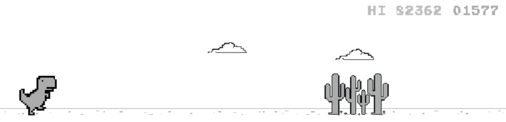

## ABOUT ME

Hello, world. I'm Yuvraj Singh, currently I'm studying **software developer** at *MITT, Winnipeg, Canada*.

I'm diligently mastering programming languages, algorithms, and data structures, while constantly honing my skills through coding practice.

My programming experience includes JavaScript, CSS, HTML, React, C#, Java. Would you like to know more? Get in touch. I look forward to hearing from you.

##

### My skills

  &nbsp;
  &nbsp;
  &nbsp;
  &nbsp;
  &nbsp;
  &nbsp;

##

### My stats

